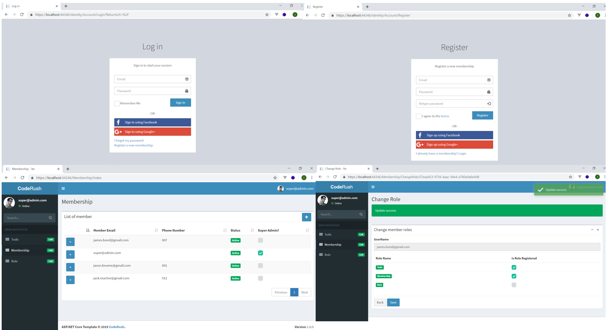

# AdminLTE-Roles-And-Memberships-Example
ASP.NET Core 2.2 Roles And Memberships Customization Implemented Using Beautiful AdminLTE Template. C# as programming language and EF (Entity Framework) as ORM.

Features:

1. configuration over development (Identity configuration through appsettings.json)
2. custom error handling (ex: 404 and 500 custom error page)
3. user membership with dynamics roles management
4. dbinitializer for data seed (ex: super admin user initialization)
5. user registration and change password management
6. basic profile management
7. override identity user with custom column
8. active / de-active member
9. custom security service implemented through DI (dependency injection)
10. xsrf / anti forgery token

Technical:

1. C#
2. EF (Entity Framework)
3. jQuery
4. Bootstrap
5. Datatables.net
6. crud
7. toastr
8. mssql

# Development Tools & Environment

I'm using **Visual Studio Community 2017** for the development tools on Windows 10 machine.

# .Net Core Version

I'm using **.Net Core 2.2**

# Supported by CodeRush.Co
[CodeRush.CO] source code collections (https://coderush.co) lot of cool open source apps there. 50% Off All Products, Use Discount Code **GITHUB50**

